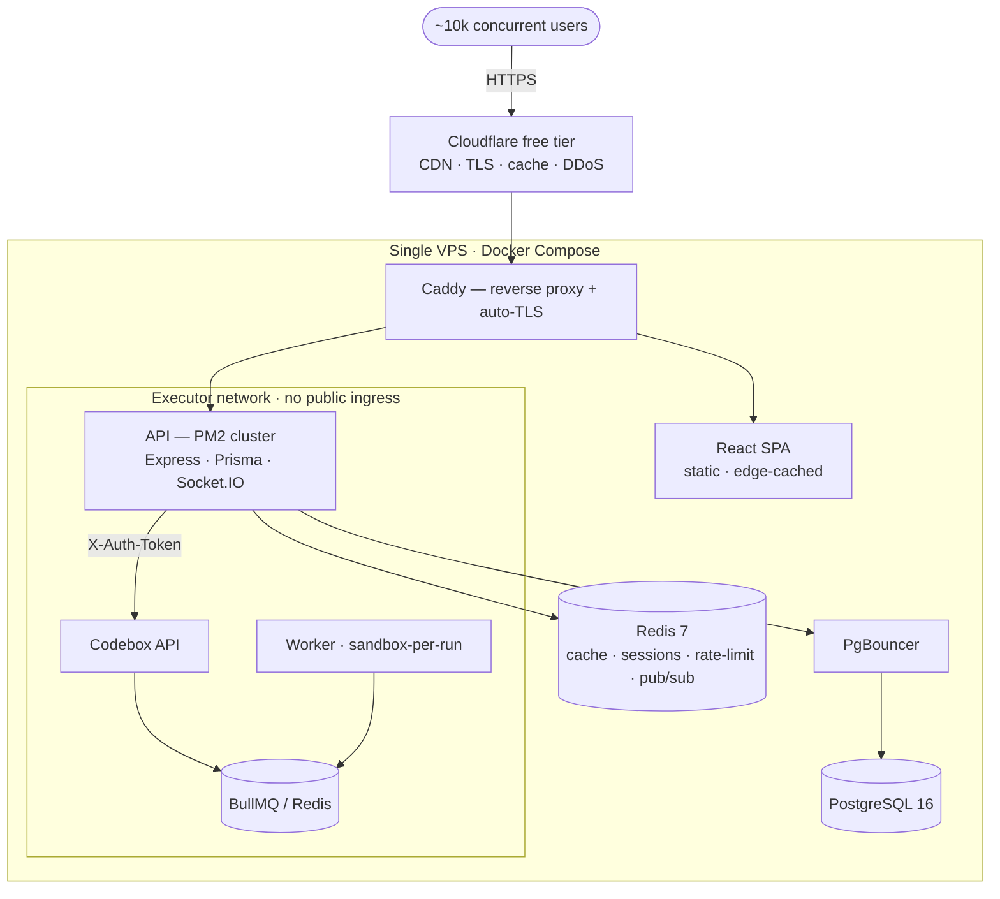

<div align="center">

# 🏟️ CodeArena

### A self-hosted, LeetCode-style DSA platform — built for personal mastery *and* community.

*Grind algorithm problems in a real Monaco editor, judged by a sandboxed executor, on infrastructure deliberately engineered to serve **~10,000 concurrent users from a single low-cost VPS.***

[](https://react.dev)
[](https://nodejs.org)
[](https://expressjs.com)
[](https://www.prisma.io)
[](https://www.postgresql.org)
[](https://redis.io)
[](https://www.docker.com)
[](https://vite.dev)

**Live (soon):** [`codearena.kodexa.in`](https://codearena.kodexa.in) &nbsp;·&nbsp; **Status:** 🚧 active rewamp toward v0.1

</div>

---

## ✨ What is CodeArena?

CodeArena is a full-stack competitive-programming platform in the spirit of LeetCode — a warm, focused place to solve data-structures & algorithms problems in a **VS-Code-grade editor**, run your code against real test cases in a **sandboxed executor**, track your progress with streaks and stats, and (soon) share solutions with a community.

It's **free forever** — no paywalls, no premium tiers, no feature gating. If it helps you, there's a *pay-what-you-want* Support page. That's the entire business model.

It is also, unapologetically, an **engineering showcase**: a from-scratch rewamp built to prove that a genuinely useful, secure, real-time coding platform can serve a community of thousands **without a cloud bill that hurts** — one modest VPS, one `docker compose up`, fronted by Cloudflare's free tier. The full design is written up in [`architecture.md`](./architecture.md); progress is tracked in [`progress.md`](./progress.md).

### What you can do with it

- 🧠 **Solve problems** in Python, JavaScript, Java, C, or C++ against hidden test cases
- ▶️ **Run** custom input for quick iteration, then **Submit** for a full, recorded verdict
- 📊 **Track progress** — solved problems, submission history, streaks, per-difficulty stats
- 🗂️ **Follow curated DSA sheets** and build personal playlists
- 🏆 **Compete in contests** with a **live Socket.IO leaderboard**
- 👑 **Administer everything** from a single-admin dashboard (problems, sheets, contests, users, moderation)
- 🧡 **Support the project** via optional Razorpay donations

---

## 🎯 Engineering highlights (the fun part)

Every claim below maps to code in this repo — not a wishlist.

### 🔒 Answer-free by construction
The problem API ships **strict server-side projections** ([`problem.controllers.js`](./backend/src/controllers/problem.controllers.js)): `PUBLIC_LIST_SELECT` and `PUBLIC_DETAIL_SELECT` whitelist exactly what a normal user may read — statement, examples, constraints, hints, and starter snippets — and **never** select `testcases` or `referenceSolutions`. The answers cannot leak because they're never put on the wire. Admins get the full record through a separate code path.

### ⚖️ Judging is 100% server-side
When you Submit, the client sends only `source_code + language_id + problemId`. The server ([`executeCode.controllers.js`](./backend/src/controllers/executeCode.controllers.js)) fetches the **real, hidden** test cases itself, runs them, compares `stdout` server-side, persists a `Submission` + per-test-case `TestCaseResult` rows, upserts `ProblemSolved`, and returns a **safe verdict** — pass/fail counts, status, timings — with no hidden I/O echoed back. **Run** hits a separate path that only accepts a single custom stdin and writes nothing.

### 🧩 A pluggable, protocol-based execution engine
All code execution sits behind **one lib boundary** ([`executor.lib.js`](./backend/src/libs/executor.lib.js)) speaking the **Judge0-CE protocol** (numeric language IDs, `submit → poll-by-token` batch model). The default engine is self-hosted **[Codebox](https://github.com/hiteshchoudhary/Codebox)** — *sandbox-per-run*: no network, dropped Linux capabilities, non-root, CPU/memory/PID limits. Judge0 stays a **drop-in break-glass fallback**, swapped by config, not by rewrite. The lib even papers over Codebox's real-world quirks — `X-Auth-Token` instead of `Authorization: Bearer`, and automatic **≤20-per-request batch chunking** with in-order token reassembly.

### ✅ Content that cannot lie
Seed & admin-authored problems are gated by an **oracle check** (`validateReferenceSolutions`): every reference solution is executed against **every** test case through the live judge, and the problem is rejected on the first mismatch. If it's in the bank, a correct solution is *guaranteed* to pass the judge users will hit.

### 🛡️ Hardened API surface (already in place)
[`index.js`](./backend/src/index.js) ships `helmet`, env-driven CORS (`FRONTEND_ORIGIN`), `trust proxy` for correct client IPs behind Caddy + Cloudflare, a JSON body cap, a global 404, a consistent error envelope, and **tiered rate limiting**: a global API limiter, a strict auth limiter (login/register brute-force defense), and a dedicated **execute limiter** so a "Run" stampede can't melt the box.

### 👑 Radically simple RBAC
One admin, one flag. Roles collapse to `USER | ADMIN`; the admin is simply whoever registers with `ADMIN_EMAIL`. No promote/demote machinery, no role-change audit tables — a deliberate ~1,000-line deletion that removes an entire class of bugs for a solo maintainer.

### 🎨 A real, token-driven design system
The entire UI is built on **Organic** — a warm design language (cream & terracotta, `Caprasimo` display + `Figtree` body, over-rounded shapes, OKLCH tonal ramps). Every color, radius, and shadow flows from CSS variables in [`organic.css`](./frontend/src/styles/organic.css); nothing is hard-coded.

---

## 🏗️ Architecture



**How 10k concurrent fits on one cheap box** — the load-shaping thesis:

1. **Cloudflare absorbs the reads.** The static SPA and cacheable public pages are served from the edge; the origin sees a fraction of the traffic.
2. **The API is stateless (JWT)** → run it as a **PM2 cluster**, one worker per core. Scale *up*, not out.
3. **Postgres is protected** by **PgBouncer** (many app connections → few PG connections) plus **Redis** caching of hot reads (problem list, leaderboard, streaks).
4. **Socket.IO uses the Redis adapter**, so every cluster worker shares rooms across 10k live connections.
5. **Execution is the real bottleneck, not web traffic.** 10k users ≠ 10k simultaneous runs — a **bounded queue + per-user submit rate limit** makes a stampede degrade gracefully instead of taking down the host. *This is the single most important scaling decision.*

> **Honest status:** the tiered rate-limiting, `helmet`/CORS hardening, `trust proxy`, and the answer-free judging pipeline are **live today**. Redis, PgBouncer, PM2-cluster, and the Cloudflare/Caddy edge are the **target deployment topology** (provisioned in `docker-compose` / detailed in `architecture.md`) — wired up as the rewamp reaches Phase 10.

### Request lifecycle — a submission
`browser → Cloudflare → Caddy → API /api/v1/execute-code (execute rate-limiter) → server fetches the problem's hidden test cases → batches them to Codebox over the internal network (≤20/chunk) → Codebox runs each in an isolated container → API compares stdout, writes Submission + TestCaseResult, upserts ProblemSolved → returns a safe verdict.`

---

## 🧰 Tech stack

| Layer | Choice | Why |
|---|---|---|
| **Frontend** | React 19 · Vite 7 · React Router 7 · Zustand | Fast, modern, minimal state |
| **Editor** | Monaco (`@monaco-editor/react`) · `react-split` · `framer-motion` | The VS Code editor, in the browser |
| **Forms** | `react-hook-form` · `zod` | Typed, validated inputs |
| **Design** | **Organic** design system (token-driven CSS) | One warm, consistent visual language |
| **Backend** | Node 20 · Express 4 (ESM) · Prisma 6 ORM | Simple, typed data access, easy to reason about |
| **Database** | PostgreSQL 16 (+ PgBouncer at scale) | Relational integrity + connection pooling |
| **Realtime** | Socket.IO | Live contest leaderboards |
| **Executor** | Self-hosted **Codebox** (Judge0-CE compatible) | Sandboxed execution, zero per-run cloud cost |
| **Auth** | JWT (access + refresh) · `bcryptjs` · OAuth *(planned)* | Cookie sessions today, GitHub/Google next |
| **Security** | `helmet` · `express-rate-limit` · env CORS | Hardened by default |
| **Payments** | Razorpay — *donations only* | Pay-what-you-want, INR-native |
| **Scale infra** | Redis 7 · PM2 cluster · Cloudflare · Caddy | Caching, sessions, edge, auto-TLS *(target)* |

---

## 🗃️ Data model

A single Prisma schema ([`schema.prisma`](./backend/prisma/schema.prisma)) spans the whole product, thoughtfully indexed for read-heavy access:

- **Identity** — `User` (with `username`, `points`, email-verification & reset fields), `OAuthAccount` (multi-provider linking, `@@unique([provider, providerId])`)
- **Practice** — `Problem` (unique `slug` for SEO, `published` flag, `@@index([published, difficulty])`), `Submission` + `TestCaseResult`, `ProblemSolved`, `Playlist`
- **Contests** — `Contest`, `ContestParticipant`, `ContestSubmission`, `ContestLeaderboard` (indexed by `contestId, totalScore, penalty`)
- **Sheets** — `Sheet`, `SheetProgress` (all free)
- **Community** — `Solution`, `Discussion`, `Comment` (threaded), `Vote`, `Follow`, `Report` *(models in place; endpoints on the roadmap)*
- **Support** — a lean `Donation` (nullable donor, optional supporters-wall opt-in)

---

## 📂 Project structure

```
CodeArena/
├── backend/                   # Node + Express + Prisma API
│   ├── prisma/
│   │   ├── schema.prisma       # single-admin, community, donations, slugs
│   │   └── seed.js             # admin + starter problems (oracle-validated)
│   └── src/
│       ├── controllers/        # auth · problem · executeCode · dashboard · contest · …
│       ├── routes/             # /api/v1/*
│       ├── middleware/         # JWT auth + single-admin checkAdmin + optionalAuth
│       ├── libs/               # executor (Codebox) · db · email · payments · socket
│       └── utils/              # ApiError · ApiResponse · asyncHandler
├── frontend/                  # React 19 + Vite SPA (Organic design system)
│   └── src/
│       ├── components/         # AppShell, ProtectedRoute, Spinner, …
│       ├── pages/              # Dashboard · Problems · ProblemEditor · Support · …
│       ├── store/              # Zustand auth store
│       └── styles/organic.css  # the design tokens + components
├── design/                    # the imported Organic design (16 screens)
├── docker-compose.yml         # full-stack topology
├── architecture.md            # the full architecture & 12-phase plan
└── progress.md                # what's built, phase by phase
```

---

## 🚀 Quickstart (local dev)

**Prerequisites:** Node 20+, Docker.

```bash
# 1) Database (Postgres in Docker)
docker run -d --name codearena-pg \
  -e POSTGRES_USER=myuser -e POSTGRES_PASSWORD=mypassword -e POSTGRES_DB=codearena \
  -p 5432:5432 postgres:16-alpine

# 2) Backend
cd backend
npm install
cp ../.env.example .env          # then edit values (DATABASE_URL, SECRET, ADMIN_EMAIL, …)
npx prisma migrate dev           # apply the schema
node prisma/seed.js              # admin + starter problems (oracle-validated)
npm run dev                      # → http://localhost:8080

# 3) Frontend (second terminal)
cd frontend
npm install
npm run dev                      # → http://localhost:3000
```

Open **http://localhost:3000**, register (the account matching `ADMIN_EMAIL` becomes the admin), and start solving.

> **Code execution** needs the Codebox engine running — see [`architecture.md` §8](./architecture.md). On the production VPS it runs with `EXECUTOR_TYPE=isolate`; the app itself boots fine without it (you just can't Run/Submit until it's up).

---

## 🌍 Deployment

CodeArena targets a **single VPS** (e.g. Hetzner CPX31 → CPX41, ~€15–30/mo) behind **Cloudflare's free tier**:

- **Caddy** terminates TLS and reverse-proxies the SPA + API at `codearena.kodexa.in`.
- One `docker compose` brings up the frontend, API (PM2 cluster), Postgres (+ PgBouncer), Redis, and the **isolated** Codebox executor — which never gets public ingress.
- Cloudflare provides CDN, caching, and DDoS protection for free; the origin sees a fraction of the traffic and the origin IP stays hidden.
- Ops is low-touch: nightly `pg_dump` backups pushed off-box, `ufw` + `fail2ban` + key-only SSH, `restart: unless-stopped`, and a `/health` check.

Full runbook and the 12-phase build plan live in [`architecture.md`](./architecture.md) and [`progress.md`](./progress.md).

---

## 🗺️ Status & roadmap

CodeArena is being rebuilt from the ground up. Current state:

- ✅ **Backend reshaped** — single-admin schema; community + donation models; answer-free problem API; secure server-side judging. Runs, migrated, seeded.
- ✅ **Hardening** — helmet, env CORS, `trust proxy`, tiered rate limiting, consistent errors + 404.
- ✅ **Auth** — email/password with JWT cookie sessions, wired end-to-end.
- ✅ **Solving loop** — public problem browsing + a Monaco editor with Run/Submit + recorded verdicts.
- 🚧 **Executor** — Codebox integrated behind the Judge0-protocol lib; final validation on the deploy VPS (pilot gate).
- 🔜 **Next** — community (solutions, discuss, profiles, global leaderboard, streaks), GitHub/Google OAuth + real email, Redis-backed sessions/cache, the DSA content library, and the production 10k deploy.

See [`progress.md`](./progress.md) for the phase-by-phase tracker.

---

<div align="center">

**Built by Rahul Raj** · a free platform for the community, and a playground for doing infrastructure *right* on a budget.

*If CodeArena helps you, the in-app **Support** page keeps the lights on. 🧡*

</div>
