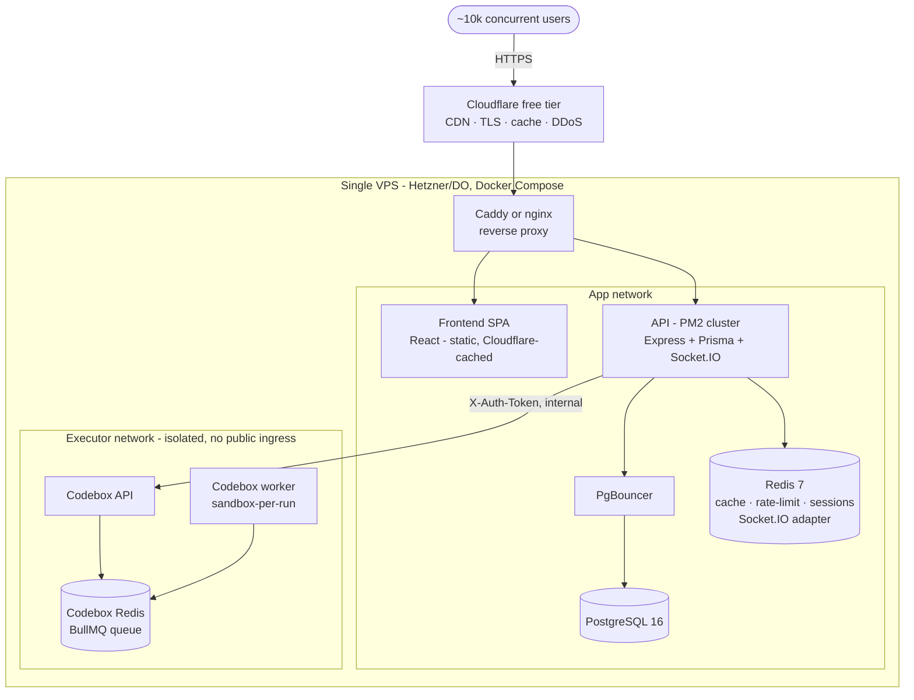

# CodeArena — Architecture & Rewamp Plan

> **What this is:** the single source of truth for the CodeArena rewamp — target architecture,
> migration from the current build, and the decisions behind it. A **living planner**, not code.
> Execution is tracked task-by-task in [`progress.md`](./progress.md).
>
> **Product:** a LeetCode-style coding platform (formerly *LeetLab*), **personal + community**, at
> **`codearena.kodexa.in`**. Self-hosted, **built to comfortably serve ~10,000 concurrent users on a
> low-cost single VPS** — not designed for hundreds of thousands.
>
> **Design:** the full UI is designed in the **Organic** design system (Claude Design project
> `a6fc6049…`, 16 pages). The frontend is built to that design; see §6.
>
> _Last updated: 2026-07-15._

---

## 1. Locked decisions

| # | Decision | Choice |
|---|----------|--------|
| D1 | **Docs reset** | Legacy `docs/` + stray guides + old `Readme.md` deleted. These two files are the plan. |
| D2 | **Monetization** | **Fully free.** No paid tiers, no feature gating. Add a **Support page — pay-what-you-want donations** via Razorpay (INR, already integrated). §7. |
| D3 | **Auth** | Email/password **+ GitHub + Google OAuth** + real email (verify / reset). |
| D4 | **Executor** | **Self-hosted Codebox** as sole executor (pilot-gated; Judge0 kept as break-glass behind the lib boundary). §8. |
| D5 | **Admin model** | **Single admin, no SUPERADMIN.** Roles collapse to `USER | ADMIN`; the design already gates admin behind one `isAdmin` flag. One admin account, bootstrapped by env/seed. §5.2. |
| D6 | **Scale & cost** | **Target ~10k concurrent users, spend very little.** Single VPS + **Cloudflare free tier** in front; scale *up* the one box, not out. §9. |
| D7 | **Design system** | **Organic** (warm, rounded, token-driven). Port its one `styles.css` into the app; build every page to the design. §6. |

---

## 2. Current-state assessment (honest baseline)

Grounded in a read of the actual code, not the old docs' claims (which overstated "80% done").

### 2.1 Works
Email/password auth (JWT access+refresh in cookies, first-user bootstrap); RBAC middleware; problems/submissions CRUD with batch execution + per-testcase results; Judge0 batch execution cleanly isolated behind `libs/judge0.lib.js`; contests with a working Socket.IO `leaderboardUpdate`; sheets & playlists; Razorpay order/verify/refund.

### 2.2 Stub / half-built
| Feature | Reality |
|---|---|
| AI Code Review | 4-line stub (`res.send("AI Code Review")`). |
| Email verification | Schema fields only; no route/controller. |
| Password reset | **Insecure** — returns `{ resetToken }` in the HTTP body; email TODO; `nodemailer` not installed. |
| Redis | Provisioned in compose, **zero code usages**. |
| Multi-device sessions | `UserSession` table unused; only `User.refreshToken` is read. |
| Community | **Does not exist** — no solutions/discussions/comments/votes/follow; no public profiles; no global leaderboard; no streak/heatmap. |

### 2.3 Bugs & security issues (fix during backend reshape)
1. **Answer leak** — `getAllProblem` returns `testcases` + `referenceSolutions` to any user, no pagination.
2. **SUPERADMIN blocked** — `createProblem`/`updateProblem` gate on `role !== "ADMIN"` (moot after D5, but the inline check must go).
3. **Only first language validated** — `createProblem` writes + `return`s inside the reference-solution loop.
4. **Reset-token leak** — see 2.2.
5. **Hardcoded CORS** — `localhost:3000` in `index.js` + `socket.js`.
6. **No hygiene** — no zod, rate limiting, helmet, pagination, request logging; inconsistent errors; 404 handler commented out.

### 2.4 Repo hygiene debt
~12 dead frontend duplicates (`*.bak/New/Old`); `backend/cookies.txt` leftover; `leetlab-*` container names; `SECRET` vs `JWT_SECRET` inconsistency. The frontend is being **rebuilt fresh** to the new design, so the old `frontend/src` is throwaway (salvage only `apiClient`, service patterns, and any still-valid logic).

---

## 3. Target architecture at a glance

**Load-shaping principles (the whole 10k story):**
- **Cloudflare absorbs the reads.** Static SPA + public problem/solution pages are cached at the edge — origin sees a fraction of the 10k.
- **The API is stateless** (JWT) → run it as a **PM2 cluster** (one worker per core); scale by adding cores to the one box.
- **Postgres is protected** by PgBouncer (many app conns → few PG conns) + Redis caching of hot reads (problem list, leaderboard, streaks).
- **Socket.IO uses the Redis adapter** so all cluster workers share rooms for 10k live connections.
- **The executor is the real bottleneck**, not web traffic — 10k users ≠ 10k simultaneous runs. A **bounded queue + per-user submit rate limit** keeps the box safe under a "Run" stampede (§8.4). This is the single most important scaling decision.

---

## 4. Target tech stack

| Layer | Choice | Notes |
|---|---|---|
| Frontend | React + Vite, **Organic design tokens** (ported `styles.css`) | Fresh rebuild to the design. §6. |
| Routing/state | react-router + Zustand + react-query (or SWR) | react-query for cache/dedupe of API reads (helps at scale). |
| Editor | Monaco (`@monaco-editor/react`) | Problem editor. |
| Backend | Node ≥20, Express (ESM), Prisma, **PM2 cluster** | Harden + reshape. |
| DB | PostgreSQL 16 **+ PgBouncer** | Transaction pooling for 10k. |
| Cache/queue/rt | Redis 7 | Cache, rate-limit, sessions, **Socket.IO adapter**, BullMQ (executor). |
| Executor | **Codebox** (self-hosted) | Judge0-compatible. §8. |
| Auth | JWT + OAuth (GitHub, Google) + `nodemailer` | §5. |
| Payments | Razorpay — **donations only** | Pay-what-you-want Support page. §7. |
| Edge | **Cloudflare (free)** → Caddy (auto-TLS) | §9. |
| Validation | **zod** (backend) | Mirror frontend schemas. |
| Observability | `pino` + `/health` + uptime monitor | §10. |

---

## 5. Auth, identity & the single-admin model

### 5.1 Auth (D3)
- Keep email/password; make `password` nullable for OAuth-only users.
- **OAuth**: GitHub + Google. Use an `OAuthAccount` model (one user links multiple providers) — cleaner than provider fields on `User`.
- **Real email** (`nodemailer` + SMTP): implement the missing verify-email route; **email** the reset token (stop returning it). Gate community *posting* (not solving) on `emailVerified`.
- **Sessions**: put refresh-token state in **Redis** (fits the cluster; retires the dead `UserSession` table) — real "logout everywhere."

### 5.2 Single admin (D5) — big simplification
The design gates the entire admin surface behind **one boolean** (`<sc-if value="{{ isAdmin }}">`). Match it:
- **Drop `SUPERADMIN`.** `enum UserRole { USER, ADMIN }` (or a plain `isAdmin Boolean`). One admin — you.
- **Delete the promote/demote/role-change machinery** (`RoleChange` model, `rbac.controllers.js`, most of `userManagement.controllers.js`). This removes ~1,000 lines and a whole class of bugs — good for a solo, low-cost build.
- **Bootstrap the admin** by env (`ADMIN_EMAIL`) at seed/first-login, not "first user becomes superadmin."
- `checkAdmin` middleware guards every `/api/v1/admin/*` route; users never see admin UI (the shell hides it when `!isAdmin`).

---

## 6. Frontend — build to the Organic design

### 6.1 Design system (D7)
**Organic**: warm cream ground (`--color-bg #f5ead8`), ink text (`#201e1d`), terracotta accent (`--color-accent #c67139`), sage second accent (`--color-accent-2 #7a8a5e`); **Caprasimo** headings + **Figtree** body; 16px radii growing to `999px` pills; OKLCH tonal ramps `100–900`; `--shadow-sm/md/lg`; Lucide icons at stroke-width 2.75.
- **Port the single `styles.css`** (`:root` tokens + component classes `.btn/.tag/.field/.input/.card/.nav/.table/.dialog/.washed`) into the app as the base stylesheet. **Take every color/font/radius/shadow from the tokens** — never hard-code values. This *is* the styling contract.
- Rebuild the design's `.dc.html` component conventions (`<dc-import name="AppShell">`, `{{props}}`, `<sc-if>`, `<sc-for>`) as **React components** — the `.dc.html` files are the visual spec, not app code.

### 6.2 AppShell (the layout every logged-in page uses)
248px sidebar (`--color-surface`): brand → **Practice** (Dashboard, Problems, DSA Sheets, Playlists, Contests, Leaderboard, Submissions) → **Account** (Profile, Settings, **Admin** — only if `isAdmin`) → **"Support CodeArena"** card (repurposed from the design's "Go Premium" upsell) → user chip. Top bar (68px): page title, optional search, streak badge, notifications bell, avatar. Props mirror the design: `active, pageTitle, userName, userRole, streak, isAdmin, showSearch`.

### 6.3 Page inventory (16 designed pages → routes)
Grouped as in `Overview.dc.html`. Each designed page has 1–2 directions (e.g. `1a/1b`) — pick one per page at build time.

| Group | Page | Route | Notes / API |
|---|---|---|---|
| Entry | **Landing** | `/` (public) | Marketing home. Public, SEO + Cloudflare-cached. |
| Entry | **Auth** (`4a/4b`) | `/login`, `/register` | Email/password + GitHub + Google. |
| Entry | **Onboarding** | `/onboarding` | 4-step first-run (pick languages, goals, a starter sheet). |
| Practice | **Dashboard** (`1a/1b`) | `/app` | Streak/heatmap, recent submissions, recommended, stats. |
| Practice | **Problems** (`2a/2b`) | `/problems` | Public list — filters (difficulty/tag/status), search, **paginated, answer-free**. |
| Practice | **ProblemEditor** (`3a/3b`) | `/problems/:slug` | Monaco, Run/Submit → Codebox, testcase results, editorial/solutions/discuss tabs. |
| Practice | **Sheets** (`9a/9b`) | `/sheets`, `/sheets/:id` | Curated DSA sheets (all free). List + detail with progress. |
| Practice | **Submissions** (`6a/6b`) | `/submissions` | History + detail, filter by verdict/language. |
| Practice | **Contests** (`11a/11b`) | `/contests`, `/contests/:id` | Hub + live board (Socket.IO). |
| Practice | **Leaderboard** | `/leaderboard` | Podium + global ranks (points). |
| Account | **Profile** (`7a/7b`) | `/u/:username` | Public profile: solved, streak heatmap, solutions, badges. |
| Account | **Settings** | `/settings` | Account, prefs, linked OAuth, email, sessions. |
| Account | **Support** (replaces Pricing `10a/10b`) | `/support` | **Pay-what-you-want donation** (Razorpay). §7. |
| Account | **Admin** (`13a/13b`) | `/admin` | Single-admin dashboard. §6.4. |

> **Design deviation (D2):** the designed **Pricing** page (Free/Pro $8/Teams $29 + Stripe checkout + "Go Premium" upsell) is **not built**. Its checkout/summary layout is reused for the **Support** page (custom amount, Razorpay). The Pro/Teams tiers, "Popular" badge, and gated feature lists are dropped.

### 6.4 Admin dashboard (design 13a/13b, adapted for free + single-admin)
- **Overview**: KPI cards — Total users, Active today, Submissions today, **Donations this month** (replaces "Pro subscribers / MRR"); submissions-per-day chart; **moderation queue** (flagged discussions, contributed problem drafts, support tickets); recent signups table.
- **Manage**: tabbed CRUD tables for **Problems** (search + All/Published/Draft filter + New + edit/delete + acceptance + publish state), **Sheets**, **Contests**, **Users** (view/ban), **Moderation** (approve/reject/hide reported content).
- All under `/admin/*`, `checkAdmin`-guarded.

---

## 7. Support page — pay-what-you-want (D2)

Replaces paid tiers. Everything on CodeArena is free; the Support page lets anyone donate any amount voluntarily.
- **Provider: Razorpay** (already integrated in `payments.lib.js`; INR-native; lower fees than Stripe for India). Keep `createRazorpayOrder`/`verifyRazorpayPayment`; drop the sheet/premium wiring.
- **Flow**: user enters a custom amount (or picks a preset ₹99 / ₹299 / ₹499 / custom) → backend creates a Razorpay order for that amount → Razorpay Checkout → webhook/verify signature → record a `Donation` row → thank-you state. Optional: display name + message on a "supporters" wall (opt-in).
- **Schema**: reuse/repurpose `Payment` → a lean `Donation { id, userId?, amount, currency "INR", gatewayOrderId, gatewayPaymentId, status, name?, message?, createdAt }`. No entitlement/`UserSheet` logic — a donation grants nothing but goodwill.
- **Admin**: "Donations this month" KPI + a donations list.
- **Cost note**: Razorpay charges per-transaction only; no fixed cost. Fits "spend very little."

---

## 8. Code execution: Judge0 → Codebox

**Codebox** (`github.com/hiteshchoudhary/Codebox`) is a **Judge0-CE-compatible** self-hosted engine (Node + BullMQ + ioredis + dockerode): same numeric language IDs (Python 71/Java 62/JS 63/C 50/C++ 54), same `/submissions/batch` submit→poll model, same response fields + status enum.

### 8.1 Migration is contained to the lib
Execution is isolated behind `libs/judge0.lib.js` (rename → `executor.lib.js`), 4 functions, 2 consumers (`executeCode`, `problem` controllers). Controllers don't change — they do their own `stdout.trim() === expected.trim()` compare.

### 8.2 Three required changes (verified against the repo — not a *pure* drop-in)
1. **Auth header** — Codebox uses `X-Auth-Token`, not `Authorization: Bearer`.
2. **`submitBatch` is hardcoded to `sulu.sh`** and ignores env — point both functions at `CODEBOX_API_URL`.
3. **Batch cap = 20** — the current controller sends one submission per test case with no chunking, so >20 test cases break today. **Chunk ≤20** on submit + poll.

New env: `CODEBOX_API_URL`, `CODEBOX_AUTH_TOKEN`. Remove `SULU_API_KEY`, `JUDGE0_API_URL`.

### 8.3 Self-host
Three services on the isolated `executor` network: `codebox-redis`, `codebox-api` (internal only), `codebox-worker` (sandbox-per-run). Build language images. `EXECUTOR_TYPE=isolate` (mature) or `firecracker` (microVM) if the VPS has KVM — avoid the docker-socket path (worker gets host-root). Never expose Codebox publicly.

### 8.4 Scaling execution for 10k users (critical)
- **Bounded worker concurrency** (`WORKER_CONCURRENCY` = executor cores); the BullMQ queue absorbs spikes.
- **Per-user submit rate limit** at the API (e.g. 1 in-flight run/user, N/min) + a global cap; return **queue position** so a stampede degrades gracefully instead of melting the box.
- Cache identical (code, language, stdin) results briefly to dedupe.
- This is why 10k concurrent users is fine on a cheap box: web traffic is cached by Cloudflare, and *execution* is queued and rate-limited rather than run all at once.

### 8.5 ⚠️ Verification caveat (D4)
Adversarial review said **"hedge-with-fallback,"** not an unqualified yes: Codebox is genuine and active but **young** (~5 months, single-org, **no LICENSE file** despite an MIT claim), and less battle-tested for untrusted code. **Honour D4 via**: (a) a **pilot gate** — run the full reference set through it + soak-test + verify the sandbox + confirm a real LICENSE before cutover; (b) keep Judge0 as **break-glass** behind the lib boundary (no rewrite to swap back). Reconsider if the pilot fails.

---

## 9. Deployment — 10k concurrent, very low cost (D6)

### 9.1 The cheap-but-capable shape
- **Cloudflare free tier in front of one VPS.** Free CDN, TLS, caching, DDoS. This is the biggest cost/scale lever — it serves static assets + cacheable public pages so the origin handles far less than 10k.
- **One VPS, scaled up.** Recommend **Hetzner** (best price/perf): start **CPX31** (4 vCPU / 8 GB, ~€14/mo), scale to **CPX41** (8 vCPU / 16 GB, ~€28/mo) if load needs it. DigitalOcean/Vultr are alternatives.
- **No managed services** (self-host Postgres/Redis/executor). Domain already owned. **Est. total: ~€15–30/mo + per-transaction Razorpay fees.**

### 9.2 On-box topology (Docker Compose)
Caddy (80/443, auto-TLS) → static frontend + **API (PM2 cluster, 1 worker/core)** → **PgBouncer** → Postgres, + Redis (cache/rate-limit/sessions/Socket.IO adapter). Codebox stack on a **separate internal network, no public ingress**. Only Caddy publishes ports.

### 9.3 DNS + TLS
- Cloudflare DNS: `A`/`AAAA` `codearena` → VPS IP, **proxied (orange cloud)**. Cloudflare terminates TLS at the edge; Caddy holds an origin cert (Full-Strict).
- If not using Cloudflare's proxy, Caddy issues Let's Encrypt directly for `codearena.kodexa.in`.

### 9.4 Scaling knobs for 10k
| Concern | Setting |
|---|---|
| API concurrency | PM2 cluster = #cores; keep handlers non-blocking. |
| WebSockets (10k live) | Socket.IO **Redis adapter**; raise `ulimit -n`; sticky sessions across workers. |
| DB connections | PgBouncer transaction pooling; Prisma `?pgbouncer=true`; sane pool size. |
| Read load | Redis cache (problem list, leaderboard, streaks, profiles) + Cloudflare edge cache + react-query client cache. |
| Execution | Bounded queue + per-user rate limit (§8.4). |
| Static | Vite build, immutable hashed assets, cached by Cloudflare. |

### 9.5 Ops (low-touch)
- **Secrets** in git-ignored `.env`; consolidate `SECRET`/`JWT_SECRET`; add Codebox + OAuth + SMTP + Razorpay keys; retire Sulu/Judge0 keys.
- **Backups**: nightly `pg_dump`, rotated + pushed off-box (Cloudflare R2 free tier / cheap object store). Test a restore. Redis AOF on.
- **Deploy**: `git pull` → build → `prisma migrate deploy` → `up -d` → health check; `restart: unless-stopped`.
- **Harden host**: `ufw` (22/80/443), `fail2ban`, SSH key-only, unattended security upgrades, patched kernel (executor safety). Cloudflare hides the origin IP; consider firewalling origin to Cloudflare IP ranges.
- **Load test** to ~10k before launch (k6/Artillery) — verify Cloudflare cache-hit ratio, socket capacity, and executor queue behaviour.

---

## 10. Cross-cutting hardening (all currently missing)

| Concern | Plan | Priority |
|---|---|---|
| Validation | `validate(zodSchema)` middleware everywhere. | P0 |
| Pagination + projection | `take/skip`/cursor + filters + `select` away answers on all lists. | P0 |
| Rate limiting | `express-rate-limit` (Redis store) on auth, execute, community writes, support. | P0 |
| Security headers / CORS | `helmet`; env `FRONTEND_ORIGIN` in `index.js` + `socket.js`. | P0 |
| Errors | `asyncHandler` everywhere; consistent `ApiError`; one handler; re-enable 404. | P0 |
| Caching | Redis for hot reads (list/leaderboard/streak/profile). | P1 |
| Logging/health | `pino` + request id; real `/health` (DB+Redis ping); uptime monitor. | P1 |
| Observability | Cloudflare analytics + basic metrics; error tracking (self-host or free tier). | P1 |

---

## 11. Data model evolution (Prisma)

- **Simplify roles (D5):** `UserRole { USER, ADMIN }`; drop `RoleChange`, promote/demote.
- **Identity/community:** `User.username @unique`, `bio`, social links; `password` nullable; optional `points`.
- **Problem:** `slug @unique` (SEO + idempotent seeding), optional `companies[]`, `@@index(difficulty, tags)`, `published Boolean` (design shows draft/published), answer-free public projection.
- **OAuth:** `OAuthAccount { userId, provider, providerId, @@unique([provider, providerId]) }`.
- **Community:** `Solution`, `Discussion`, `Comment`, `Vote`, `Follow`, `Report`. Streaks/heatmap derive from `Submission.createdAt` (cached). Global leaderboard = `points` counter.
- **Payments → donations (D2):** drop `UserSheet`/premium/`Sheet.type` gating; add lean `Donation` (§7). Sheets stay as free curation.

---

## 12. Phase plan (→ `progress.md`)

Frontend and backend proceed largely in parallel. Ordering favours a working vertical slice early.

| Phase | Theme | Gate |
|---|---|---|
| **0** | Foundation, cleanup, **port Organic design system** | Repo clean; tokens + base components in the app; builds green. |
| **1** | **DB & backend reshape** — single-admin, drop superadmin/payments-gating, new schema (slug, community, donation, oauth) | Migrations applied; audit bugs fixed. |
| **2** | **Executor → Codebox** + pilot gate | Sample problems judged under load; sandbox verified; LICENSE confirmed. |
| **3** | **Backend build-out & hardening** — every endpoint the design needs; validation/rate-limit/pagination/caching | API complete + hardened; answer-free public reads. |
| **4** | **Auth** — OAuth (GitHub/Google) + real email + Redis sessions | All login flows + verify/reset working. |
| **5** | **Frontend build** — AppShell → pages (Dashboard, Problems, Editor, Sheets, Submissions, Contests, Leaderboard, Profile, Settings, Auth, Onboarding, Landing) | Core loop usable end-to-end against the real API. |
| **6** | **Community** — profiles, solutions, discuss, votes, follow, streaks, leaderboard, moderation | MVP community live. |
| **7** | **Support page** — Razorpay pay-what-you-want + admin donations view | Donations working end-to-end. |
| **8** | **Admin dashboard** — overview KPIs + manage tabs (problems/sheets/contests/users/moderation) | Single admin can run the platform. |
| **9** | **DSA content pipeline & seeding** (OneDay = manifest; author + oracle-generate tests + validated seed) — Wave 1→3 | Problems seeded & validated. |
| **10** | **Deploy** — Cloudflare + VPS + PM2/PgBouncer/Redis-adapter; backups; firewall; **load-test to 10k** | Public HTTPS at `codearena.kodexa.in`, holds 10k. |
| **11** | **Launch hardening** — logging, observability, SEO, rewrite README | Ready for community. |

Phases 0–4 (backend/DB/executor/auth) run alongside 5 (frontend). 9 (content) needs 2 (executor) + a working problem model. 10 needs 1–8.

### 12.1 Detailed phase-by-phase plan

**Phase 0 — Foundation & design system.** ✓ Frontend rebuilt fresh in `frontend/`; Organic `styles.css` ported; AppShell + Dashboard(1a) + Support built; builds/lints green. ◻ Remaining: rename `leetlab-*`→`codearena-*`, drop `backend/cookies.txt`, consolidate `SECRET`/`JWT_SECRET`, rewrite `.env.example` (add `CODEBOX_*`/`FRONTEND_ORIGIN`/OAuth/SMTP/Razorpay; drop Sulu/Judge0). **Gate:** clean repo, green builds.

**Phase 1 — DB & backend reshape.** ✓ Target schema written + validated (single-admin, community, donation, oauth, slugs). ✓ Foundation controller migration: `auth.middleware.js` (single-admin, aliased exports), `problem.controllers.js` (authorId/slug/published, answer-free projection + pagination, all 3 audit bugs fixed). ◻ Remaining = **§12.2 controller migration**. **Gate:** `prisma generate`+`migrate dev` clean; all controllers run on the new schema; audit bugs closed.

**Phase 2 — Executor → Codebox.** Self-host `codebox-{redis,api,worker}` (isolated network); rewrite `executor.lib.js` (base URL both fns, `X-Auth-Token`, ≤20 batch chunking); **pilot gate** (run reference set, soak under load, verify sandbox, confirm LICENSE) before cutover. **Gate:** sample problems judged correctly + sandbox verified.

**Phase 3 — Backend build-out & hardening.** Every endpoint the design needs (problems public/paginated, sheets, submissions, contests, leaderboard, profiles, settings); `zod` validation, `express-rate-limit` (Redis), `helmet`, env CORS, `asyncHandler`+consistent `ApiError`, 404; Redis caching of hot reads; per-user submit rate-limit + bounded executor queue. **Gate:** API complete + hardened; answer-free public reads verified.

**Phase 4 — Auth.** GitHub + Google OAuth (`OAuthAccount`, nullable password); `nodemailer`+SMTP (verify-email route; email the reset token — never return it); move refresh-token state to **Redis** (retire the transitional `User.refreshToken`); gate community posting on `emailVerified`. **Gate:** all login/verify/reset flows working.

**Phase 5 — Frontend build.** ✓ AppShell + router + Dashboard(1a) + Support + Landing/Login + scaffolds. ◻ Build the remaining designed pages (Problems, ProblemEditor, Sheets, Submissions, Contests, Leaderboard, Profile, Settings, Onboarding) against the real API; react-query cache; loading/empty/error states; responsive; replace mock data. **Gate:** core solve loop end-to-end.

**Phase 6 — Community.** Profiles by username, solutions+upvotes, discussions+comments, follow/feed, streak/heatmap (from `Submission.createdAt`, cached), global leaderboard (points), moderation (`Report`+admin queue). **Gate:** MVP community live.

**Phase 7 — Support page.** Razorpay custom-amount order → Checkout → verify signature/webhook → `Donation` row → thank-you; admin donations view; optional supporters wall. **Gate:** donations end-to-end.

**Phase 8 — Admin dashboard.** Overview KPIs (users/active/submissions/donations), submissions chart, moderation queue, signups; manage tabs (problems/sheets/contests/users). All `checkAdmin`-guarded. **Gate:** single admin can run the platform.

**Phase 9 — DSA content pipeline.** OneDay = curriculum manifest; author originals; per-language I/O harness; oracle-generate tests; `seed-problems.js` validation gate + idempotent upsert; Waves 1→3. **Gate:** problems seeded + validated.

**Phase 10 — Deploy + scale to 10k.** Hetzner + Cloudflare; Caddy → PM2-cluster API → PgBouncer → PG + Redis; Codebox isolated; backups; firewall; **load-test to ~10k**. **Gate:** public HTTPS holding 10k.

**Phase 11 — Launch hardening.** `pino` logs, `/health`, uptime, error tracking, SEO (slugs/meta/sitemap), rewrite README. **Gate:** ready for community.

### 12.2 Backend controller migration (Phase 1 breakdown)

Execution is isolated behind `executor.lib.js`; the schema reshape only touches controllers that referenced removed models/fields. Status:

| File | Status | Work |
|---|---|---|
| `middleware/auth.middleware.js` | ✓ done | Single-admin (`USER\|ADMIN`), `checkAdmin` + back-compat aliases, drop permission matrix / `promotedBy`/`promotedAt` from select. |
| `controllers/problem.controllers.js` | ✓ done | `authorId`, `slug`, `published`, answer-free `PUBLIC_*_SELECT`, pagination/filters; fixed answer leak, SUPERADMIN-block, create-in-loop bugs. |
| `controllers/executeCode`, `submission`, `playlist`, `contest`, `aiCodeReview` | ✓ no change | No removed-model refs (contest models, submissions, playlists unchanged). |
| `controllers/rbac.controllers.js` + its imports in `auth.routes.js` | ◻ remove | SUPERADMIN/`RoleChange` machinery — delete; strip the rbac imports/routes from `auth.routes.js`. |
| `controllers/userManagement.controllers.js` (+ routes) | ◻ simplify | Drop promote/demote/`RoleChange`/`promotedBy`; keep single-admin list / get / ban / activate. |
| `controllers/sheets.controllers.js` (+ routes) | ◻ de-monetize | Remove `UserSheet`/`Payment`/`SheetType`/`price`; all sheets free; keep CRUD + `SheetProgress`. |
| `controllers/auth.controllers.js` (+ routes) | ◻ migrate | Role refs → `USER\|ADMIN`; remove `UserSession` usage (keep transitional `refreshToken`); **email the reset token, stop returning it**; bootstrap admin via `ADMIN_EMAIL`. |
| `libs/payments.lib.js` → `donation` | ◻ repurpose | Reuse `createRazorpayOrder(amount)` / `verifyRazorpayPayment` for the Support page; add `donation.controllers.js` + route. |
| `index.js` | ◻ update | Env-driven CORS (`FRONTEND_ORIGIN`), wire donation route, drop any removed route groups. |

Then `prisma generate` + `prisma migrate dev` on a dev DB and smoke-test. Until every ◻ is done, do not regenerate the client (the un-migrated controllers still reference removed models).

---

## 13. DSA content pipeline (OneDay → CodeArena) — summary

> Confirmed: the source repo **`github.com/Rahul5977/OneDay`** ("Ascent") is a **tracker, not a problem bank** — only curriculum metadata (`[title, source, difficulty, slug]`, phase→day→items; ~381 problems, 24 patterns). **No statements, tests, or solutions**, and LeetCode/GfG content is copyrighted (no scraping).

So OneDay is the **curriculum manifest** (identity, pattern→tag, difficulty, ordering); all judged content is **authored fresh**. Pipeline: per-language **I/O harness** (stub + driver + reference sharing one stdin/stdout serialization contract) → test cases via **reference-solution-as-oracle** (+ cross-check a 2nd reference) → **seed script** that runs every reference × every testcase through Codebox and only upserts (by `slug`) problems where all pass; dry-run; import in waves (deterministic patterns first; defer non-deterministic/checker problems). This is **post-launch** work; authoring original content is the long pole.

---

## 14. Open questions
1. **Design directions** — pick `a`/`b` per page (Dashboard 1a/1b, Problems 2a/2b, Editor 3a/3b, Submissions 6a/6b, Profile 7a/7b, Sheets 9a/9b, Contests 11a/11b, Admin 13a/13b).
2. **Frontend kickoff** — fresh rebuild (recommended) vs refactor the messy existing `frontend/src`; first vertical slice = DS + AppShell + Dashboard?
3. **Executor safety** — does the VPS support KVM (isolate/firecracker)? Confirm Codebox LICENSE (§8.5).
4. **Content** — confirm all problem statements will be original (no scraping); manual vs LLM-with-review.
5. **SEO rendering** — SSR/prerender for public problem pages, or SPA + injected meta + Cloudflare cache?
6. **Languages judged** — Python/JS/Java, or add C/C++ (Codebox supports them)?
7. **Support wall** — show opt-in supporter names/messages publicly, or keep donations private?

---

## 15. Risks

| Risk | Mitigation |
|---|---|
| Codebox immaturity / no LICENSE | Pilot gate; Judge0 break-glass behind the lib (§8.5). |
| "Run" stampede at 10k melts the box | Bounded executor queue + per-user rate limit + Cloudflare-cached reads (§8.4, §9.4). |
| Sandbox escape on a shared VPS | isolate/firecracker, no-network runner, dropped caps, patched kernel, executor off public net. |
| Content is the long pole | Manifest-driven authoring + oracle-generated tests; ship in waves. |
| Cost creep | Single VPS + Cloudflare free + no managed services + donations-only; scale up, not out. |
| Solo-maintainer scope | Strict P0/P1/P2; single-admin removes ~1k lines; free product removes payment/entitlement complexity. |

---

## 16. References
- **Design** — Claude Design project `a6fc6049-99f0-472f-a3c7-d4dfa35becca` (Organic DS `b8630ad9…`): `Overview/AppShell/Admin/Pricing/Dashboard/Problems/ProblemEditor/Sheets/Submissions/Contests/Leaderboard/Profile/Settings/Auth/Onboarding/Landing.dc.html`; `_ds/.../{styles.css, readme.md}`.
- **Codebox** — `github.com/hiteshchoudhary/Codebox` (README, `docker-compose*.yml`, `src/api/routes/submissions.js`, `src/executor/*`, `src/security/codeAnalyzer.js`, `src/languages/index.js`).
- **DSA source** — `github.com/Rahul5977/OneDay` ("Ascent"): `src/data/phases/*.js`, `src/data/hard/*.js`.
- **This repo** — `backend/prisma/schema.prisma`, `backend/src/**`, `docker-compose.yml`, `nginx/nginx.conf`, `sample-problem.sql`.
