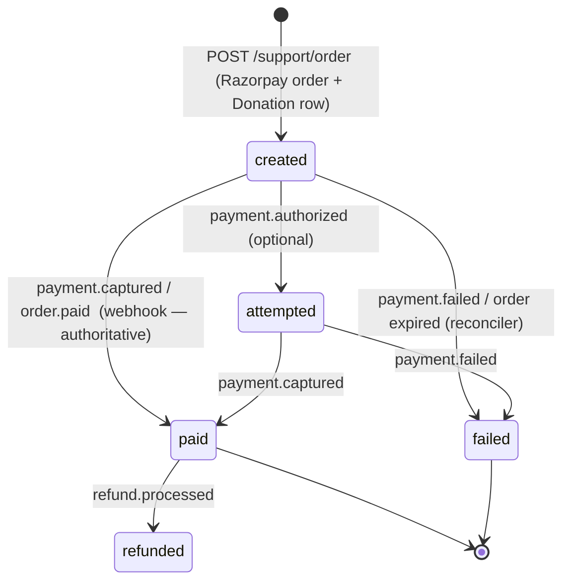
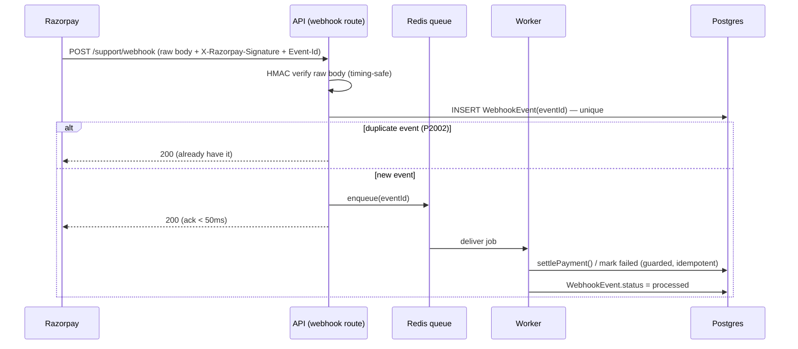

# CodeArena — UPI payments: concurrency-safe design

How UPI payments run on CodeArena, and how the system stays correct and up **even when
many people pay at the same time**. UPI is delivered through **Razorpay** (Checkout offers
UPI intent/collect as a method), so this builds on the Razorpay flow already in the repo:

- `backend/src/controllers/donation.controllers.js` — `POST /support/order`, `POST /support/verify`
- `backend/src/controllers/donationWebhook.controllers.js` — `POST /support/webhook`
- `backend/src/libs/payments.lib.js` — order creation, HMAC verify, refunds
- `Donation` model (`backend/prisma/schema.prisma`)

> The design principle in one line: **the webhook is the source of truth, every write is
> idempotent, and every external/DB call is bounded** — so a spike of concurrent payers
> degrades gracefully instead of crashing.

---

## 1. Why UPI specifically forces this design

UPI is **asynchronous and out-of-band**. The payer approves the collect/intent request in
*their* UPI app (GPay/PhonePe/…), which can land **seconds to minutes later**, and they often
**close the browser tab** before it settles. Consequences:

- The **client-side callback** (`/support/verify`) is a best-effort UX nicety — it frequently
  never fires for UPI. **You cannot rely on it.**
- The **webhook** (`payment.captured` / `order.paid`) is the only reliable settlement signal.
- Webhooks can arrive **late, duplicated, or out of order**, and can be **missed** entirely
  (network blip) — so you also need a **reconciliation** safety net.

Everything below follows from "treat the webhook as truth, make it idempotent, never trust
the client, and never block."

---

## 2. Lifecycle & state machine



`paid` and `failed` are **terminal**. Every transition is applied with a **guard** so it can
only happen **once**, no matter how many callers race for it (§4).

---

## 3. Data model (extend `Donation` + add two small tables)

Additive, zero-downtime migrations.

```prisma
model Donation {
  // ...existing fields...
  gatewayOrderId   String   @unique          // already present — 1 order ⇒ 1 row
  gatewayPaymentId String?  @unique           // ADD @unique — a payment settles ≤ 1 donation
  idempotencyKey   String?  @unique           // ADD — dedupe double-clicked "create order"
  status           String   @default("created") // created | attempted | paid | failed | refunded
  amount           Float                        // fixed at creation; never trusted from client at verify
  @@index([status, createdAt])                  // for the reconciler sweep
}

// Every Razorpay webhook delivery, stored once — dedup + audit + async processing.
model WebhookEvent {
  id          String   @id @default(uuid())
  eventId     String   @unique   // Razorpay `x-razorpay-event-id` — dedup key
  type        String              // payment.captured, payment.failed, order.paid, refund.processed
  payload     Json                // raw verified event
  status      String   @default("pending") // pending | processed | dead
  attempts    Int      @default(0)
  createdAt   DateTime @default(now())
  processedAt DateTime?
  @@index([status, createdAt])
}
```

The **unique constraints are the backbone of correctness under concurrency**: two racing
writers for the same order/payment/event can't both succeed — one wins, the other gets a
`P2002` we handle as a no-op.

---

## 4. The one idempotent settle function (exactly-once side effects)

Both `/verify` (client) and the webhook worker funnel into a single guarded transition. The
**guard is the `where` clause**: only a row still in a non-terminal state flips, and
`updateMany` returns a **count** telling us whether *we* were the winner.

```js
// settlePayment(orderId, paymentId): returns true only for the caller that actually flipped
// created/attempted -> paid. Safe to call any number of times, from any number of workers.
async function settlePayment(orderId, paymentId) {
  const { count } = await db.donation.updateMany({
    where: { gatewayOrderId: orderId, status: { in: ["created", "attempted"] } },
    data:  { status: "paid", gatewayPaymentId: paymentId },
  });
  if (count === 1) {
    // WE won the transition — fire side effects EXACTLY once (wall entry, receipt email,
    // points, metrics). Anyone else who raced gets count === 0 and does nothing.
    await onDonationPaid(orderId);
  }
  return count === 1;
}
```

This makes the verify-vs-webhook race, duplicate webhooks, and reconciler re-runs all
**safe**: whoever gets there first settles it and triggers side effects once; everyone else
is a cheap no-op. (Today's code uses `updateMany` but without the `status IN (...)` guard, so
side effects would double-fire once they exist — this is the key hardening.)

---

## 5. The three entry points, hardened

### 5a. Create order — `POST /support/order` (idempotent)
- Accept a client **`Idempotency-Key`** (a UUID the frontend generates per checkout attempt).
- `db.donation.create({ ... idempotencyKey })`; on `P2002` (key already used → double-click /
  retry), **return the existing order** instead of creating a second one.
- Amount is validated and **frozen** here; it's never re-read from the client afterwards.
- Wrap the Razorpay call in the bounded client (§6): timeout + limited retries + circuit breaker.
- Per-user **rate limit** (e.g. 5 orders / minute) so nobody can spam-create orders.

### 5b. Client verify — `POST /support/verify` (fast-path, best-effort)
- HMAC-verify `order_id|payment_id` (existing `verifyRazorpayPayment`).
- Call `settlePayment(orderId, paymentId)` → instant "thank you" UX **if** the callback fires.
- **Never the sole path** — if it doesn't fire (typical for UPI), the webhook settles it.

### 5c. Webhook — `POST /support/webhook` (authoritative; fast ACK + async)



Why this shape survives a stampede:
- **Verify → persist → ACK 200 in milliseconds.** The DB/side-effect work happens **off the
  request path** in a worker, so a burst of settlements can't back up the HTTP layer or make
  Razorpay retry-storm (it retries on non-200/slow responses).
- **`WebhookEvent.eventId @unique`** dedupes Razorpay's own retries and any at-least-once
  delivery — each event is processed once.
- Worker concurrency is **capped**, so 500 simultaneous captures drain at a controlled rate
  instead of opening 500 DB connections at once.

> **Minimal variant:** at today's volume you can keep the settle **inline** in the webhook
> (single-row guarded `updateMany`, then 200) — it's O(1) and already fast. Add the
> Redis/BullMQ queue when side effects get heavy (emails, third-party calls) or volume grows.
> Redis is already in the stack, so the upgrade is cheap.

---

## 6. Bounded external calls — the "don't crash" core

Every call that can be slow or fail is wrapped so a dependency problem **degrades**, never
cascades:

- **Timeouts** on every Razorpay call (e.g. 8s) — no request hangs forever holding a worker.
- **Retries with jitter**, capped (e.g. 2) — smooth transient blips without thundering-herd.
- **Circuit breaker** — if Razorpay error-rate spikes, trip open and fail fast with a friendly
  "payments are briefly unavailable, try again" instead of piling up in-flight requests until
  the process OOMs.
- **DB connection pooling** — put **PgBouncer** (transaction mode) in front of Postgres and set
  `?pgbouncer=true`; keep the Prisma pool bounded. Postgres defaults to ~100 connections;
  without pooling, a payment spike × API replicas exhausts them and *that* is what crashes an
  app. Every payment op is a **single short transaction / single-row upsert** — no long locks.
- **Per-user rate limits** on order creation (Redis-backed so they're shared across replicas).

---

## 7. Reconciliation — the safety net (no payment ever lost)

A cron every ~5 min (and a nightly deep sweep):

1. `Donation` rows in `created`/`attempted` older than ~10 min → `razorpay.orders.fetch(orderId)`
   + `orders.fetchPayments(orderId)`.
2. If a captured payment exists → `settlePayment()` (idempotent). If the order expired / all
   payments failed → mark `failed`.
3. `WebhookEvent` rows stuck `pending` with `attempts < N` → re-enqueue; beyond N → `dead` +
   alert.

This guarantees **eventual consistency even if every webhook is dropped** — the ledger
self-heals from Razorpay, which is the real source of truth.

---

## 8. Security

- **Webhook**: HMAC-SHA256 over the **raw bytes** with `RAZORPAY_WEBHOOK_SECRET`, `timingSafeEqual`
  — already done; keep it mounted with `express.raw()` **before** `express.json()`.
- **Verify**: HMAC over `order_id|payment_id` with the key secret — binds a payment to *our* order.
- **Never trust client-sent amount/status.** Amount is frozen at order creation; status only ever
  advances via a verified signal (verify HMAC, webhook HMAC, or a Razorpay API fetch).
- Secrets (`RAZORPAY_KEY_SECRET`, `RAZORPAY_WEBHOOK_SECRET`) live only in the server `.env`
  (already forwarded by `docker-compose.prod.yml`); the key **id** is the only value sent to the browser.
- Idempotency + unique constraints also blunt replay attacks (a replayed verify/webhook is a no-op).

---

## 9. Scaling to "many at once" — why it holds

| Concern under concurrent load | How this design absorbs it |
|---|---|
| Two writers race the same payment (verify + webhook + reconciler) | Guarded transition + unique `gatewayPaymentId` → one wins, rest are no-ops. Never a crash, never double-charge/double-credit. |
| Different payers at the same time | Each is an **independent row** keyed by `gatewayOrderId` — **no shared mutable state**, so zero contention between payers. |
| Webhook burst (many settle together) | Fast ACK + async worker with **capped concurrency** → the queue absorbs the spike; Razorpay never retry-storms. |
| DB connection exhaustion | PgBouncer + bounded pool + single-row short transactions. |
| Razorpay slow/down | Timeout + retry + **circuit breaker** → fail fast & friendly; process stays healthy; reconciler recovers later. |
| Duplicate deliveries / double-clicks | `WebhookEvent.eventId`, `gatewayOrderId`, `gatewayPaymentId`, `idempotencyKey` uniques. |
| Horizontal scale | API is **stateless** (JWT); state is in Postgres + Redis → run N replicas / a PM2 cluster behind Caddy with no code change. |

The system has **no global lock and no in-process state**, so adding capacity is purely
"add replicas + raise the pool," and a spike shows up as *slightly slower settlement*, not an
outage.

---

## 10. Implementation plan (incremental, on top of what exists)

1. **P0 — correctness:** add the `status IN ('created','attempted')` **guard** to the settle
   update in `donation.controllers.js` (verify) and `donationWebhook.controllers.js`; extract
   the shared `settlePayment()`; add `gatewayPaymentId @unique`. *(Small diff, big safety win.)*
2. **P0 — idempotent create:** accept `Idempotency-Key`; add `Donation.idempotencyKey @unique`;
   return the existing order on `P2002`.
3. **P0 — safety net:** `WebhookEvent` table (dedup + audit) + the **reconciliation cron**.
4. **P1 — resilience:** wrap `payments.lib.js` calls in timeout + retry + circuit breaker;
   Redis-backed per-user rate limit on `/support/order`.
5. **P1 — scale:** move webhook settle into a **Redis/BullMQ** worker (fast ACK); add PgBouncer.
6. **P2 — ops:** metrics (orders created/paid/failed, webhook lag, stuck count) + alerts on
   `dead` events / stuck `created` rows; handle `payment.failed`, `order.paid`, `refund.processed`.

Steps 1–3 make it **correct and never-lose-a-payment** at current scale; 4–6 make it hold under
real burst load.

---

## 11. Env & Razorpay setup (recap)

- `.env`: `RAZORPAY_KEY_ID`, `RAZORPAY_KEY_SECRET`, `RAZORPAY_WEBHOOK_SECRET` (all forwarded by
  `docker-compose.prod.yml`).
- Razorpay Dashboard → Webhooks → `https://codearena.kodexa.in/api/v1/support/webhook`,
  subscribe to `payment.captured`, `payment.failed`, `order.paid`, `refund.processed`; set the
  signing secret = `RAZORPAY_WEBHOOK_SECRET`.
- Enable **UPI** as a payment method on the Razorpay account; Checkout then surfaces UPI
  intent/collect automatically — no app change needed for the method itself.
